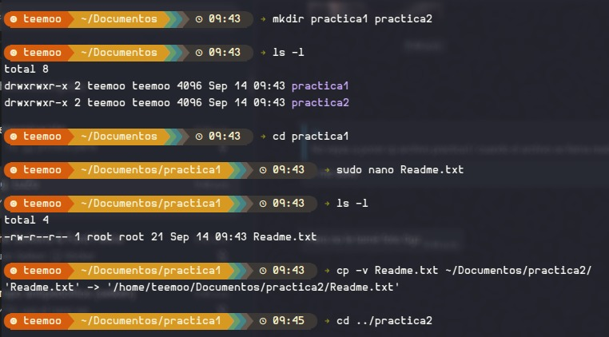
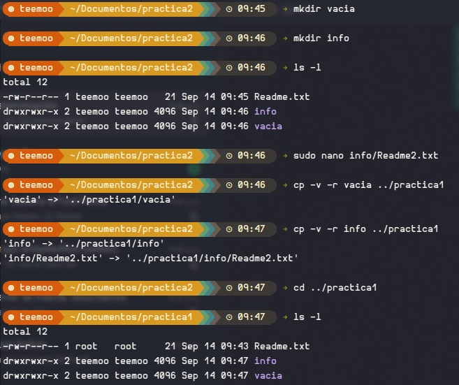
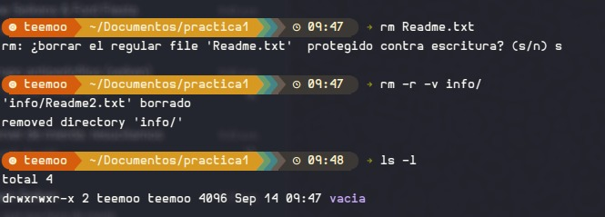

# Práctica: Comandos de copiar y borrar en Linux

* Se crearon directorios y archivos de prueba desde la terminal para preparar el entorno de trabajo.
* Se practicó el uso de `cp` para copiar archivos individuales entre directorios y `cp -r` para copiar directorios completos.
* Se utilizó la opción `-v` (modo detallado) para visualizar en pantalla cada operación realizada por el comando.
* Se practicó `rm` para eliminar archivos y `rm -r` para eliminar directorios junto con su contenido.
* Se navegó entre directorios con `cd`, incluyendo rutas relativas como `../practica2`, y se verificó cada resultado con `ls -l`.

## Objetivos

* Crear la estructura de directorios y archivos necesaria para realizar operaciones de copiado y borrado.
* Copiar archivos y directorios utilizando rutas absolutas y relativas.
* Comprender la diferencia entre copiar un archivo y copiar un directorio de forma recursiva.
* Eliminar archivos y directorios de manera controlada, reconociendo cuándo el sistema solicita confirmación.
* Verificar con `ls -l` el estado del sistema de archivos después de cada operación.
* Identificar el efecto de `sudo` sobre el propietario y los permisos de los archivos creados.

## Explicación de los comandos utilizados

### Preparación del entorno

| Comando | Descripción |
| --- | --- |
| `mkdir practica1 practica2` | Crea dos directorios en una sola instrucción dentro de la ubicación actual. |
| `mkdir vacia` / `mkdir info` | Crea directorios individuales usados como origen de las copias recursivas. |
| `ls -l` | Lista el contenido en formato largo: permisos, propietario, grupo, tamaño y fecha. |
| `cd practica1` | Entra al directorio indicado mediante una ruta relativa. |
| `cd ../practica2` | Sube un nivel y entra a un directorio hermano en la misma instrucción. |
| `sudo nano Readme.txt` | Abre el editor de texto con privilegios de administrador para crear el archivo. |

### Copiar

| Comando | Descripción |
| --- | --- |
| `cp -v Readme.txt ~/Documentos/practica2/` | Copia el archivo al directorio destino usando ruta absoluta con `~`; `-v` muestra el origen y el destino de la copia. |
| `cp -v -r vacia ../practica1` | Copia un directorio de forma recursiva; al estar vacío solo se reporta la creación del directorio. |
| `cp -v -r info ../practica1` | Copia el directorio junto con su contenido; el modo detallado reporta una línea por el directorio y otra por cada archivo interno. |

La opción `-r` (recursiva) es obligatoria para directorios: sin ella, `cp` omite el directorio y devuelve un error.

### Borrar

| Comando | Descripción |
| --- | --- |
| `rm Readme.txt` | Elimina un archivo de forma permanente. Al pertenecer a `root`, el sistema solicitó confirmación por tratarse de un archivo protegido contra escritura. |
| `rm -r -v info/` | Elimina el directorio y todo su contenido; `-v` reporta cada archivo borrado y el directorio eliminado. |

## Código

El script que reproduce la secuencia de la práctica se encuentra en:

[`./Código/script.sh`](./Código/script.sh)

Para ejecutarlo desde la terminal:

```bash
chmod +x script.sh
./script.sh
```

## Imágenes de la práctica

Las siguientes imágenes muestran el desarrollo de la práctica y los comandos utilizados en la terminal.

### 1. Primera parte

Creación de `practica1` y `practica2`, creación del archivo `Readme.txt` con `sudo nano` y copia del archivo hacia `practica2`.



### 2. Segunda parte

Creación de los directorios `vacia` e `info` dentro de `practica2` y copia recursiva de ambos hacia `practica1`.



### 3. Tercera parte

Eliminación del archivo `Readme.txt` y del directorio `info` dentro de `practica1`, con verificación final del contenido.



## Reporte

El reporte escrito de la práctica se encuentra en la carpeta [`./Reporte`](./Reporte).

## Video de la práctica

A continuación se encuentra el video correspondiente a la práctica:

[Ver video de la práctica]([ENLACE_DE_YOUTUBE](https://www.youtube.com/watch?v=WpotKuYWPtI))

## Conclusiones técnicas

* Los comandos `cp` y `rm` comparten la estructura `comando [opciones] origen [destino]`, por lo que dominar el patrón permite aplicarlo a otras herramientas de la terminal.
* La opción `-r` es indispensable al trabajar con directorios: tanto `cp` como `rm` actúan únicamente sobre archivos si no se indica el modo recursivo.
* La opción `-v` resulta muy útil con fines didácticos y de verificación, ya que confirma explícitamente qué ruta de origen se copió o borró y hacia dónde, evitando suposiciones sobre el resultado.
* Copiar un directorio vacío genera una sola línea de salida, mientras que copiar un directorio con contenido genera una línea por cada elemento; esto evidencia que la copia recursiva recorre el árbol completo.
* Crear el archivo con `sudo nano` dejó a `root` como propietario (`-rw-r--r-- 1 root root`), lo que provocó que `rm` pidiera confirmación por tratarse de un archivo protegido contra escritura para el usuario actual. Usar privilegios elevados innecesariamente complica la gestión posterior de los archivos.
* La eliminación con `rm` es definitiva: el sistema no conserva una copia de respaldo, por lo que conviene verificar la ruta con `pwd` y `ls -l` antes de ejecutar cualquier borrado recursivo.
* Alternar entre rutas absolutas (`~/Documentos/practica2/`) y relativas (`../practica1`) demuestra que ambas notaciones son equivalentes para el sistema, y que las relativas agilizan el trabajo cuando los directorios están en el mismo nivel.
