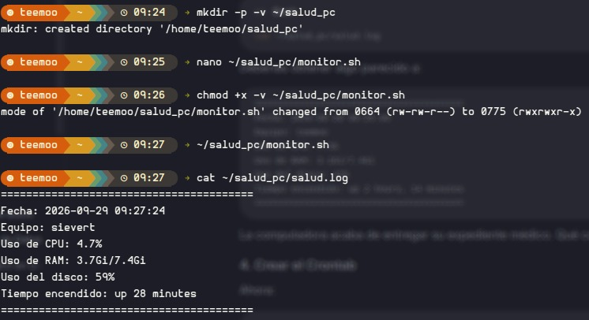
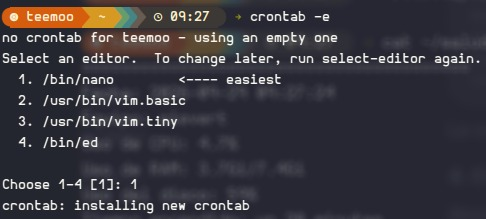
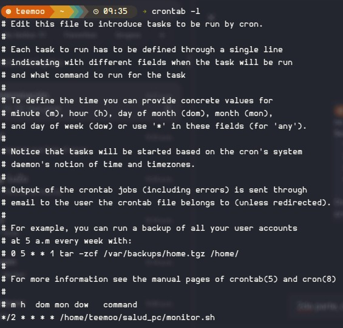
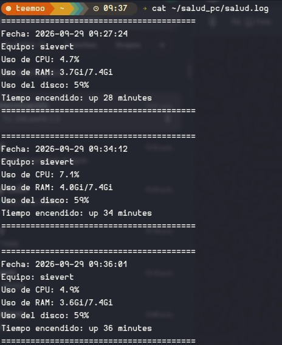

# Proyecto: Monitoreo Automatizado de Salud del Sistema (Bash y Cron)

* Se diseñó y programó un script en Bash (`monitor.sh`) para recopilar métricas clave del sistema (CPU, RAM, Disco y Uptime).
* Se le otorgaron permisos de ejecución mediante `chmod +x` y se validó su funcionamiento manual en consola.
* Se configuró el daemon de tareas programadas `cron` a través del editor `crontab -e` para automatizar la ejecución desatendida cada 2 minutos.
* Se verificó la correcta instalación y sintaxis del trabajo programado utilizando el comando `crontab -l`.
* Se confirmó la continuidad de la monitorización inspeccionando la concatenación periódica de datos en `~/salud_pc/salud.log`.

## Objetivos

* Diseñar un script reutilizable en Bash para extraer métricas de rendimiento y salud del sistema operativo Linux.
* Redirigir y concatenar salidas de texto en un archivo de registro de logs (`.log`) ubicado en el directorio del usuario.
* Programar ejecuciones periódicas desatendidas mediante el servicio `cron` con una frecuencia de 2 minutos.
* Validar el correcto funcionamiento de las tareas en segundo plano sin requerir elevación de privilegios con `sudo`.
* Muestrear el comportamiento del equipo a lo largo del tiempo comprobando las lecturas generadas de forma automática.

## Explicación de los comandos utilizados

### Comandos en Terminal

| Comando | Descripción |
| --- | --- |
| `mkdir -p -v ~/salud_pc` | Crea el directorio destino en la carpeta personal; `-p` evita errores si existe y `-v` reporta la acción. |
| `nano ~/salud_pc/monitor.sh` | Abre el editor de texto en consola para redactar el script de monitoreo. |
| `chmod +x -v ~/salud_pc/monitor.sh` | Concede permisos de ejecución al script; `-v` muestra el cambio detallado de octal `0664` a `0775`. |
| `~/salud_pc/monitor.sh` | Ejecuta de manera manual el script de monitoreo para validar su funcionamiento inicial. |
| `cat ~/salud_pc/salud.log` | Muestra en pantalla el contenido acumulado dentro del archivo de registro de salud del sistema. |
| `crontab -e` | Abre la tabla de tareas programadas del usuario actual para editar o registrar nuevos trabajos automatizados. |
| `crontab -l` | Lista las tareas programadas activas registradas en el perfil del usuario actual. |

### Sintaxis del Crontab

La instrucción añadida al crontab utiliza la siguiente estructura temporal:

```text
*/2 * * * * /home/teemoo/salud_pc/monitor.sh
 │  │ │ │ │
 │  │ │ │ └── Día de la semana (0 - 6, donde 0 es Domingo)
 │  │ │ └───── Mes (1 - 12)
 │  │ └──────── Día del mes (1 - 31)
 │  └────────── Hora (0 - 23)
 └───────────── Minuto (*/2 indica cada 2 minutos)
```

## Código

Los scripts correspondientes a esta práctica se encuentran organizados en la carpeta [`./Código y Scripts`](./Código%20y%20Scripts):

* Script de monitoreo: [`./Código y Scripts/monitor.sh`](./Código%20y%20Scripts/monitor.sh)
* Secuencia de terminal: [`./Código y Scripts/codigoTerminal.sh`](./Código%20y%20Scripts/codigoTerminal.sh)

### 1. Script de Monitoreo (`monitor.sh`)

```bash
#!/bin/bash

FECHA=$(date '+%Y-%m-%d %H:%M:%S')
HOST=$(hostname)

CPU=$(top -bn1 | grep "Cpu(s)" | awk '{print 100 - $8}')
RAM=$(free -h | awk '/Mem:/ {print $3 "/" $2}')
DISCO=$(df -h / | awk 'NR==2 {print $5}')
UPTIME=$(uptime -p)

{
    echo "========================================"
    echo "Fecha: $FECHA"
    echo "Equipo: $HOST"
    echo "Uso de CPU: ${CPU}%"
    echo "Uso de RAM: $RAM"
    echo "Uso del disco: $DISCO"
    echo "Tiempo encendido: $UPTIME"
    echo "========================================"
    echo
} >> ~/salud_pc/salud.log
```

### 2. Secuencia de Ejecución (`codigoTerminal.sh`)

```bash
#!/bin/bash

# 1. Crear el directorio para almacenar los registros de salud
mkdir -p -v ~/salud_pc

# 2. Crear y redactar el script de monitoreo
nano ~/salud_pc/monitor.sh

# 3. Asignar permisos de ejecución al script
chmod +x -v ~/salud_pc/monitor.sh

# 4. Probar la ejecución manual del script
~/salud_pc/monitor.sh

# 5. Verificar la creación y primera lectura del archivo de log
cat ~/salud_pc/salud.log

# 6. Abrir el editor de tareas programadas del usuario
crontab -e
# Dentro del archivo crontab se añade la siguiente instrucción:
# */2 * * * * /home/teemoo/salud_pc/monitor.sh

# 7. Confirmar las tareas crontab registradas activas
crontab -l

# 8. Consultar el historial del archivo de registro tras unas ejecuciones automáticas
cat ~/salud_pc/salud.log
```

## Imágenes de la práctica

Las siguientes evidencias muestran el desarrollo del proyecto y los resultados obtenidos en la consola de Linux.

### 1. Primera parte: Creación de directorio, permisos y prueba manual

Creación de la carpeta `~/salud_pc`, asignación de permisos ejecutables (`chmod +x`), primera prueba directa del script y verificación del archivo `salud.log` recién generado.



### 2. Segunda parte: Selección del editor de Crontab

Apertura del configurador de tareas programadas con `crontab -e` y selección de `nano` como editor predeterminado.



### 3. Tercera parte: Verificación de la tarea programada

Confirmación mediante `crontab -l` de la regla `*/2 * * * * /home/teemoo/salud_pc/monitor.sh` para la ejecución del script cada 2 minutos.



### 4. Cuarta parte: Comprobación de automatización y logs

Lectura posterior del archivo `salud.log` donde se aprecian múltiples bloques generados automáticamente a intervalos constantes por el daemon `cron`.



## Reporte

El reporte formal documentado de la práctica se encuentra dentro del directorio [`./Reporte`](./Reporte).

## Video de la práctica

A continuación se encuentra el enlace al video con la explicación y demostración práctica del proyecto:

[Ver video explicativo del proyecto en YouTube](https://www.youtube.com/watch?v=TU_ID_DE_YOUTUBE)

## Conclusiones técnicas

* La combinación de herramientas como `top`, `free`, `df` y `awk` permite procesar datos crudos del sistema y darles un formato amigable para tareas de auditoría.
* El operador de redirección `>>` es vital para el registro de eventos (*logging*), ya que concatena información al final del archivo sin destruir el historial acumulado previamente.
* El daemon `cron` ejecuta las tareas asignadas en segundo plano dentro del entorno del usuario, eliminando la necesidad de solicitar privilegios elevados (`sudo`) cuando se trabaja sobre archivos locales.
* La sintaxis `*/N` en los campos del crontab simplifica la definición de intervalos regulares sin requerir listas exhaustivas de minutos u horas.
* La automatización mediante scripts de administración optimiza el mantenimiento preventivo de servidores y puestos de trabajo, facilitando el diagnóstico rápido ante caídas o sobrecargas de rendimiento.
