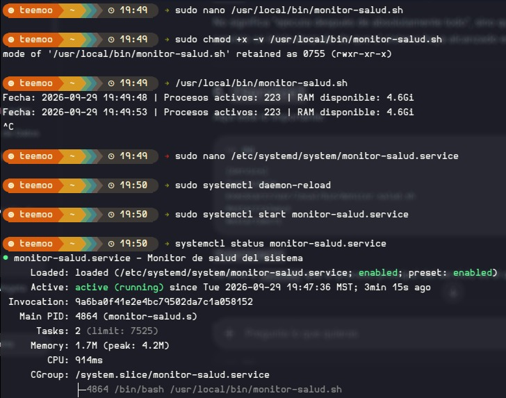
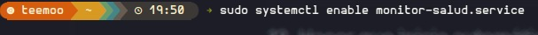
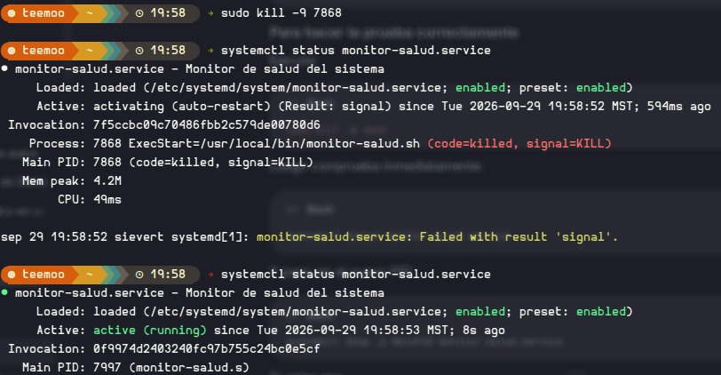

# Proyecto: Creación y Gestión de Demonios Persistentes con Systemd en GNU/Linux

* Se diseñó y programó un script en Bash (`monitor-salud.sh`) para monitorear en tiempo real métricas del sistema (fecha, procesos activos y RAM disponible) en un ciclo infinito.
* Se le otorgaron permisos de ejecución mediante `chmod +x` y se ubicó en el directorio de binarios locales (`/usr/local/bin/`).
* Se encapsuló el script como un servicio en segundo plano mediante la creación de una unidad de **systemd** (`monitor-salud.service`).
* Se habilitó la persistencia del demonio (`systemctl enable`) para garantizar su ejecución automática en cada arranque del sistema operativo.
* Se validó la resiliencia y alta disponibilidad del servicio al someterlo a una terminación forzada (`kill -9`), comprobando su recuperación automática inmediata gracias a las directivas del supervisor.

## Objetivos

* Diseñar un script continuo en Bash para la extracción de métricas de rendimiento del sistema operativo.
* Configurar e instanciar un proceso en segundo plano (demonio) utilizando el sistema de inicialización y supervisión `systemd`.
* Demostrar la tolerancia a fallos de los servicios en Linux implementando políticas de auto-recuperación (`Restart=always`).
* Comprender la interacción del núcleo de Linux frente a señales de interrupción de procesos (como `SIGKILL`).
* Aislar el monitoreo crítico del sistema sin depender de una sesión de terminal activa, utilizando grupos de control (cgroups).

## Explicación de los comandos utilizados

### Comandos en Terminal

| Comando | Descripción |
| --- | --- |
| `sudo nano /usr/local/bin/monitor-salud.sh` | Crea y edita el script ejecutable en la ruta estándar de binarios del administrador. |
| `sudo chmod +x -v .../monitor-salud.sh` | Otorga permisos de ejecución al archivo; `-v` muestra el cambio en la terminal. |
| `sudo nano /etc/systemd/.../monitor-salud.service`| Crea la configuración de la unidad del servicio en el directorio de control de systemd. |
| `sudo systemctl daemon-reload` | Obliga al supervisor systemd a recargar su configuración y reconocer el nuevo servicio. |
| `sudo systemctl start monitor-salud.service` | Arranca el servicio de monitoreo en segundo plano por primera vez. |
| `systemctl status monitor-salud.service` | Consulta el estado actual, PID principal, consumo de recursos y logs del demonio. |
| `sudo systemctl enable monitor-salud.service` | Crea un enlace simbólico para que el servicio inicie automáticamente con el sistema. |
| `sudo kill -9 <PID>` | Envía la señal `SIGKILL` para destruir el proceso forzosamente y probar su recuperación. |

## Código y Configuración

Los scripts correspondientes a esta práctica se encuentran organizados en la carpeta [`./Código y Scripts`](./Código%20y%20Scripts).

### 1. Script de Monitoreo (`monitor-salud.sh`)
*Ruta en el sistema: `/usr/local/bin/monitor-salud.sh`*

```bash
#!/bin/bash

while true
do
    FECHA=$(date '+%Y-%m-%d %H:%M:%S')
    PROCESOS=$(ps -e --no-headers | wc -l)
    RAM=$(free -h | awk '/Mem:/ {print $7}')

    echo "Fecha: $FECHA | Procesos activos: $PROCESOS | RAM disponible: $RAM"

    sleep 5
done
```

### 2. Archivo de Unidad de Systemd (`monitor-salud.service`)
*Ruta en el sistema: `/etc/systemd/system/monitor-salud.service`*

```ini
[Unit]
Description=Monitor de salud del sistema
After=multi-user.target

[Service]
Type=simple
ExecStart=/usr/local/bin/monitor-salud.sh
Restart=always
RestartSec=1

[Install]
WantedBy=multi-user.target
```

### 3. Secuencia de Ejecución de la Práctica (`terminal.sh`)

```bash
#!/bin/bash

# 1. Crear y editar el script de monitoreo en la ruta de binarios
sudo nano /usr/local/bin/monitor-salud.sh

# 2. Modificar los permisos para hacerlo ejecutable, mostrando los cambios
sudo chmod +x -v /usr/local/bin/monitor-salud.sh

# 3. Prueba manual del script para verificar su salida (Ctrl+C para detener)
/usr/local/bin/monitor-salud.sh

# 4. Crear el archivo de unidad del servicio para systemd
sudo nano /etc/systemd/system/monitor-salud.service

# 5. Recargar la configuración del supervisor systemd en memoria
sudo systemctl daemon-reload

# 6. Iniciar el demonio por primera vez
sudo systemctl start monitor-salud.service

# 7. Consultar el estado del servicio para verificar que esté "active (running)"
systemctl status monitor-salud.service

# 8. Habilitar la persistencia del servicio para futuros reinicios
sudo systemctl enable monitor-salud.service

# 9. Enviar la señal de terminación forzada (SIGKILL) al PID principal del demonio
sudo kill -9 7868

# 10. Consultar el estado inmediatamente para capturar la recuperación
systemctl status monitor-salud.service
```

## Imágenes de la práctica

Las siguientes evidencias documentan la ejecución exitosa del proyecto en el entorno GNU/Linux.

### 1. Primera parte: Creación, permisos y arranque del servicio
Creación del script en `/usr/local/bin`, prueba inicial, creación del archivo `.service`, recarga del demonio y arranque. El estado confirma que el proceso está activo.



### 2. Segunda parte: Habilitación de persistencia
Creación del enlace simbólico mediante `systemctl enable` para garantizar que el servicio sobreviva a reinicios del equipo.



### 3. Tercera parte: Prueba de tolerancia a fallos
Terminación abrupta del proceso con `kill -9 7868`. Se observa cómo `systemd` captura la señal de muerte (`signal=KILL`), entra en estado de recuperación y levanta un nuevo PID (`7997`) en cuestión de milisegundos.



## Reporte Formal

El análisis teórico y la justificación técnica de esta práctica se encuentran documentados en formato PDF dentro del directorio [`./Reporte`](./Reporte/ReporteDaemonSentinel.pdf).

## Video de la práctica

A continuación se encuentra el enlace al video con la explicación y demostración práctica del proyecto:

[Ver video explicativo del proyecto en YouTube](https://www.youtube.com/watch?v=DF9vo8-H1Ng)

## Conclusiones técnicas

* **Centralización con systemd:** El uso de archivos de unidad `.service` estandariza el despliegue de software en segundo plano, reemplazando la complejidad de los antiguos scripts de inicialización y asegurando un aislamiento total mediante *cgroups*.
* **Tolerancia a fallos:** La política `Restart=always` es un pilar fundamental en la administración de servidores, ya que garantiza la continuidad del servicio incluso ante cierres inesperados, sobrecargas o intervenciones manuales destructivas.
* **Inmunidad a bloqueos (SIGKILL):** Quedó demostrado que, aunque la señal `-9` destruye el proceso de manera irrevocable a nivel de kernel, el sistema de supervisión actúa como una red de seguridad que reestablece la instancia operando de forma autónoma.
* **Manejo de permisos:** Ubicar ejecutables en `/usr/local/bin/` y usar `sudo` garantiza que el monitoreo global del sistema esté protegido y su código fuente no pueda ser alterado por usuarios sin privilegios.
